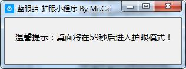
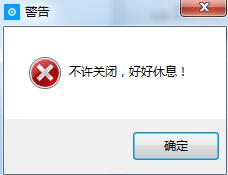
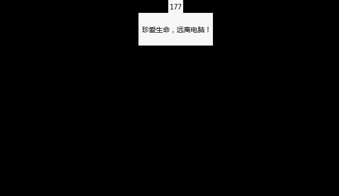
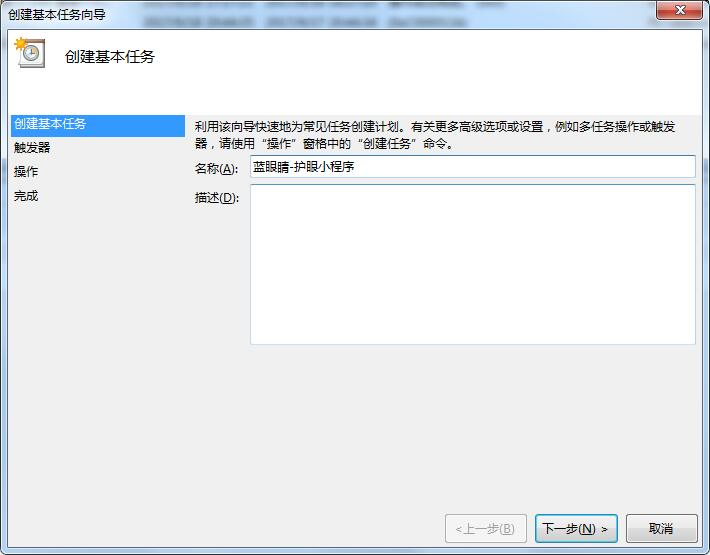
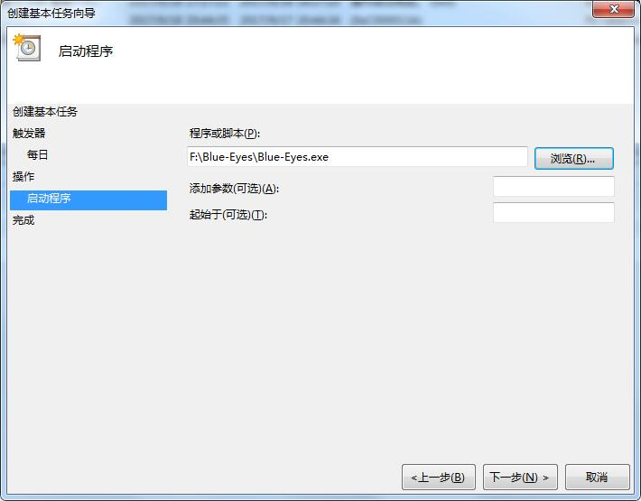
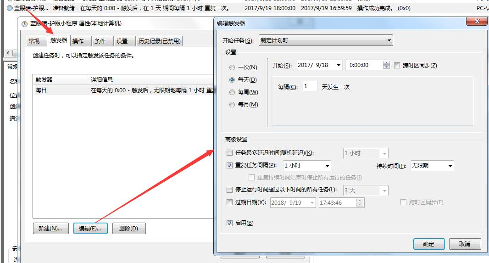

##  说明  
使用蓝眼睛-护眼小程序可有效保护你的眼睛，缓解你的疲劳。麻雀虽小五脏俱全,功能非常多。  

1、友情提示,不会让你措手不及  
  

2、程序启动后无法手动关闭(不管任何方式)  
  

3、进入护眼后显示倒计时,当然你可以离开座位倒杯水或站起来伸伸懒腰,因为它会自动帮你锁上电脑      
  

### 更新记录
#### v1.4
1、增加调用系统任务栏的开关  
2、增加自动关闭和唤醒显示器  
### v1.3
1、增加防止窗口被关闭的功能  
### v1.2
1、bugfix,兼容系统定时任务,使用sys.argv[0]替换__file__表示程序本身   
### v1.1
1、自定义锁屏时间  

### 配置说明
[System]  
`work_time`  
护眼时间段,其他时间段不进行操作  

[Time_config]  
`notice_time`  
系统进入护眼时间段时将会有一个提示框，给你一个暂停手头工作的缓冲时间(单位秒)  
`protect_time`  
提示时间到后,系统将进入护眼时间(单位秒)  
`lockworkstation`  
进入护眼时间时间后是否进行锁屏,1=锁屏,0=不锁屏  
`locktaskmgr`  
锁屏期间是否允许调用任务栏(人员可以调用任务栏可以强制关闭护眼程序),1=禁用,0=允许

### 支持操作系统
Windows (32bit/64bit):  
Windows XP or newer.

### 使用说明
1、访问链接下载.
2、将其放在任务栏里面并设置每隔一个小时执行一次,具体操作如下  
创建基本任务  
  

一路默认到选定程序    
  

设置每一个小时重复一次    
  

3、设置完成后请手动执行一次,如果有些杀毒软件会拦截它,请对其加白。  